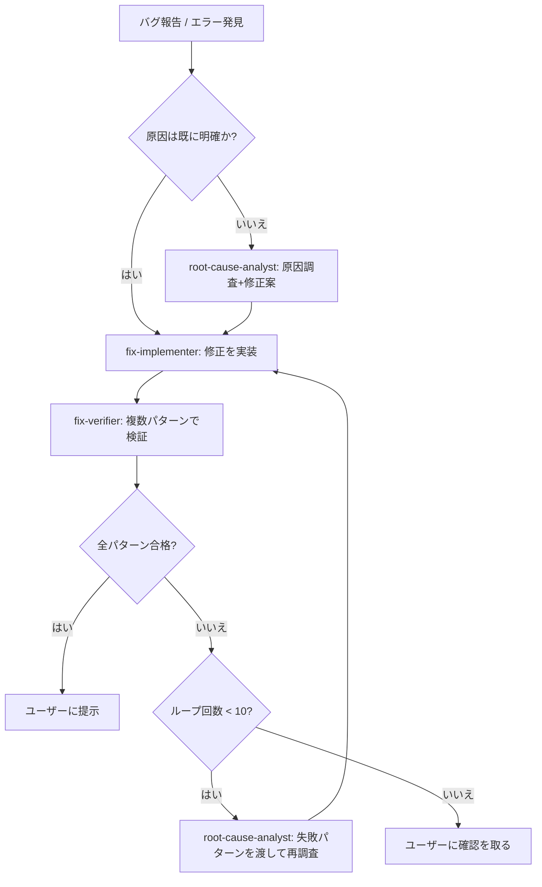

# 修正→検証ループ（fix-verify-loop）

## これは何のためのスキルか

このプロジェクトでは過去に何度も、「1つの設定・1つのケースだけ確認して直った」と判断した修正が、別の設定値（`grid_size`違い、`output_size`違い、服の丈違い等）では実は直っていなかった、というケースが起きてきた（`ani_convert_app`・`img_to_pixcel_app`の各`docs/design/*.md`の更新履歴を参照）。このスキルは、**修正のたびに複数パターンでの検証を強制し、不備が見つかったら原因解析からやり直す**プロセスを標準化する。

**このスキルは常駐的に使うこと。** ユーザーが「検証エージェントも使って」等と明示しなくても、このプロジェクト内で何らかのバグ・不具合を修正する際は、単独で `Edit` して終わりにせず、このスキルの手順に従う。

## 登場するサブエージェント（`.claude/agents/`）

| エージェント | 役割 | 保有ツール |
|---|---|---|
| `root-cause-analyst` | 原因調査（実測ベース）＋修正案の作成。実装はしない | Read, Bash, Glob, Grep |
| `fix-implementer` | 修正案を実際のコードに実装 | Read, Edit, Write, Glob, Grep, Bash |
| `fix-verifier` | 実装された修正を、複数の設定パターンで検証。実装はしない | Read, Bash, Glob, Grep |

いずれも `Agent` ツールで `subagent_type` に上記の `name` を指定して呼び出す。

## 手順

1. **初回の原因特定**（必要な場合のみ）
   - バグ報告を受けた時点で原因・修正方針が自明でなければ、まず `root-cause-analyst` を呼び、原因調査と具体的な修正案を出させる。
   - 原因・修正方針が依頼の時点で既に明確（ユーザー自身が原因と修正方針を指定した等）であれば、この工程は省略して次に進んでよい。

2. **実装**
   - `fix-implementer` を呼び、修正案（または明確化された修正方針）を渡して実装させる。
   - `Agent` ツールで呼び出す際、直前の調査・依頼内容を要約せずそのまま引き継ぐ（原因分析の詳細が実装判断に必要なため）。

3. **検証**
   - `fix-implementer` の完了後、必ず `fix-verifier` を呼ぶ。**元の1ケースが直っただけでは合格にしない。**
   - `fix-verifier` には、変更対象のコード・関連するパラメータ空間（`grid_size`/`colors`/`output_size`/ビュー構成/`facing`方向など、変更箇所に応じて該当するもの）を伝え、複数パターンでの検証を明示的に依頼する。

4. **合否判定**
   - **全パターン合格**: 検証内容の要約を添えてユーザーに提示する。この時点でループを終了する。
   - **いずれかのパターンで不備**: ループカウンタを1増やす。
     - **カウンタが10未満**: `root-cause-analyst` に、`fix-verifier` が報告した失敗パターンの詳細（どの設定で・何が起きたか）を渡して再調査させる。2回目以降は「前回の修正案の何が不十分だったか」も調査に含めるよう明示的に指示する。得られた新しい修正案を持って手順2に戻る。
     - **カウンタが10に達した**: ループを止め、これまでの各回で何を試し何が起きたかを時系列で要約し、**ユーザーに状況を報告して次の方針を確認する**（無限に自走させない）。

## ループカウンタの管理

- オーケストレーター（このスキルを実行しているエージェント自身）が、何回目の「修正→検証」サイクルかを明示的に数え、各サブエージェント呼び出しの前にユーザー向けの進捗として言及する（例:「(3/10) 修正案を実装します」）。
- `TaskCreate`/`TaskUpdate`等のタスク管理ツールが使える場合、ループの各サイクルを1タスクとして記録すると進捗が追いやすい（必須ではない）。

## 検証パターン設計の目安（`fix-verifier`に伝える情報）

修正対象に応じて、最低限含めるべき軸の例:

- `img_to_pixcel_app`関連の修正: **`CLAUDE.md`に定めた12パターン（`grid_size`∈{32,64,128} × `colors`∈{8,10} × `output_size`∈{64,128}）を必ず全て検証する**（目安ではなく固定ルール）。入力ビュー構成が絡む変更の場合は、入力ビュー構成（正面のみ／+斜め片側／+斜め両側／フル）の軸も併せて確認する
- `ani_convert_app`関連の修正: 上記に加えて、まばたき・歩行それぞれの検出結果の有無（検出できるケース／できないケースの両方）
- `agents_app`本体（`game.js`等）関連の修正: `facing`の4方向、`diagonal_left`/`diagonal_right`の有無パターン

これらはあくまで目安。実際の変更箇所に応じて `root-cause-analyst`・`fix-implementer`・`fix-verifier` 自身が適切なパターンを判断してよい。

## 注意点

- 各サブエージェントは自分の責務を超えない: `fix-verifier`は直さない、`root-cause-analyst`は実装しない、`fix-implementer`は原因を推測で決め打ちしない。役割が混線するとループの意味が無くなる。
- サーバー等を起動して検証した場合、各サイクルの最後に必ず停止する（プロセスが放置されたまま次のサイクルに入らない）。
- 10回のループ上限に達する前でも、**同じ原因・同じパターンで2回以上失敗している**兆候が見えたら、`root-cause-analyst`にその旨を明示し、根本的に別のアプローチを検討させる（同じ間違いを機械的に繰り返さない）。
