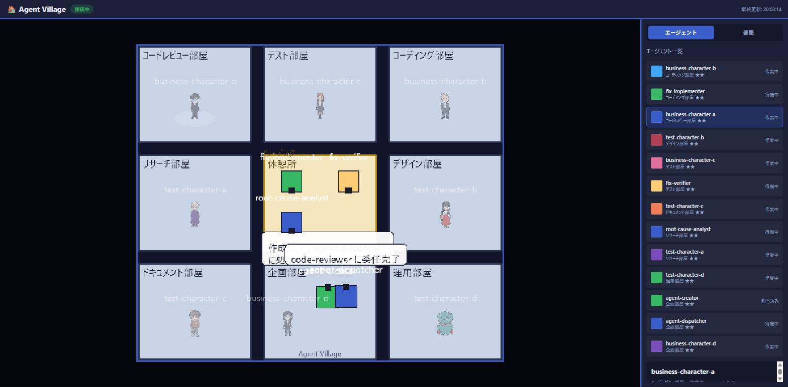
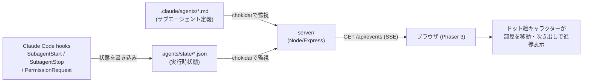
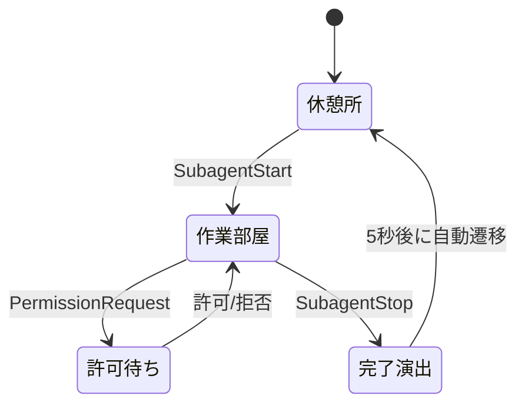

# Agent Village

Claude Code のサブエージェント群を、ピクセルアート風の「村（オフィス）」でキャラクターとして可視化するローカルダッシュボード。`.claude/agents/*.md`（サブエージェント定義）と `agents/state/*.json`（実行時の状態、Claude Code の hooks から書き込まれる）を読み取り、各エージェントを1体のドット絵キャラクターとしてブラウザ上にリアルタイム表示する。

> A local dashboard that visualizes Claude Code sub-agents as pixel-art characters wandering a Game Boy–style "village". It watches each agent's live state (written via Claude Code hooks) and streams updates to the browser over SSE. Idle agents wait in a break room; working agents occupy a role-appropriate room, with progress logs shown as chat bubbles.

## これは何に使うか（用途）

- Claude Code で複数のサブエージェントを並行運用しているとき、「今どのエージェントが何をしているか」をターミナルのログではなく一目で把握したいとき。
- 権限待ち（`PermissionRequest`）で止まっているエージェントを見逃さず、素早く気づきたいとき。
- 開発の様子をチームや視聴者に「見せる」用途（配信・デモ・社内共有など）。

## 実際の画面

**Before**: hooksが無い状態だと、エージェントの状況は `agents/state/*.json` の生ログを都度確認するしかない。

```json
{
  "agentId": "agent-creator",
  "status": "working",
  "task": { "title": "PDF抽出エージェントの新規作成", "progress": 0.2 },
  "log": [{ "ts": "2026-07-30T06:59:43.381Z", "level": "info", "text": "既存エージェント一覧を確認中…" }]
}
```

**After**: `npm start` して開いたダッシュボード。右側の一覧でエージェントの状態（作業中/待機中/割当済み）が一目で分かり、部屋の上には進捗ログの吹き出しがリアルタイムに表示される（下図は `npm run demo` のダミーデータで撮影）。



## 図解: システム構成



## 図解: エージェント1体の状態遷移



## 特徴

- **エージェント = キャラクター**: 待機中は休憩所に、作業中は役職に応じた部屋に配置され、進捗ログをチャット吹き出しで表示する。
- **リアルタイム更新**: Node.js のローカルサーバーがファイル（`.claude/agents/`・`agents/state/`）を [chokidar](https://github.com/paulmillr/chokidar) で監視し、Server-Sent Events でブラウザへ配信する。
- **Claude Code hooks 連携**: `SubagentStart` / `SubagentStop` / `PermissionRequest` の各 hook から状態ファイルを書き込むことで、実際のサブエージェントの動きをそのまま可視化する（`bin/agent-village-hook.js`）。
- **どのプロジェクトでも動く**: `agent-village` を1個のCLIコマンドとして起動すると、実行時のカレントディレクトリを自動的に監視対象（ターゲットルート）にする。このツール自体（インストールルート）と監視対象プロジェクト（ターゲットルート）は別プロジェクトでもよい。
- **ドット絵アートスタイル**: ポケモン金銀（GBC）期を基準にした見下ろし型・タイルグリッド・4方向スプライトのレトロなビジュアル（`docs/design/01-visual-concept.md`）。
- **カスタムキャラクター画像の取り込み**: [img_to_pixcel_app](https://github.com/Afarg/img_to_pixcel_app)（写真→ピクセルキャラ変換）と [ani_convert_app](https://github.com/Afarg/ani_convert_app)（まばたき・歩行差分生成）と組み合わせることで、任意の画像から作ったキャラクターをエージェントの見た目として差し替えられる。

## パイプライン全体像

このツールは3プロジェクトから成るパイプラインの最終段（表示側）。

```
① img_to_pixcel_app          ② ani_convert_app              ③ agents_app (this repo)
   写真 → ピクセルキャラ変換   →   まばたき・歩行差分生成    →   ダッシュボードで表示
```

## 使い方

### インストールと起動

```bash
npm install
npm start          # 監視対象は実行時のカレントディレクトリ
```

`npm start` を実行したディレクトリの `.claude/agents/*.md` が自動的に監視対象になる。別プロジェクトを監視したい場合は `--target` オプションで指定する。

```bash
node server/src/index.js --target "/path/to/your/project"
```

デモ用のダミーデータで動作を見たい場合:

```bash
npm run demo
```

### Claude Code の hooks と連携させる（推奨）

これを設定しないと「誰がいるか」の一覧表示にしかならない。設定すると、実際のサブエージェント実行に連動してキャラクターが自動で動く。監視対象プロジェクトの `.claude/settings.json`（またはローカルのみなら `settings.local.json`）に以下を追記する（`<agent-village-path>` は本リポジトリをクローンしたパスに置き換える）。

```jsonc
{
  "hooks": {
    "SubagentStart": [
      { "matcher": "", "hooks": [{ "type": "command", "command": "node \"<agent-village-path>/bin/agent-village-hook.js\"" }] }
    ],
    "SubagentStop": [
      { "matcher": "", "hooks": [{ "type": "command", "command": "node \"<agent-village-path>/bin/agent-village-hook.js\"" }] }
    ],
    "PermissionRequest": [
      { "matcher": "", "hooks": [{ "type": "command", "command": "node \"<agent-village-path>/bin/agent-village-hook.js\"" }] }
    ]
  }
}
```

詳細な導入手順・トラブルシューティングは `docs/manual-install-guide.md`（要点版）または `docs/setup.md`（詳細版）を参照。

### 主なAPI

| メソッド・パス | 内容 |
|---|---|
| `GET /api/snapshot` | 現在の全エージェント・部屋の状態を1回取得 |
| `GET /api/rooms` | 部屋定義の取得 |
| `GET /api/events` | 状態変化をリアルタイム配信する SSE エンドポイント |
| `PATCH /api/agents/:agentId/name` | エージェントの表示名を変更 |
| `POST /api/agents/:agentId/sprite` | キャラクター画像を差し替え |
| `POST /api/agents/:agentId/animation` | まばたき・歩行のアニメーション画像一式を登録 |
| `PATCH /POST /DELETE /api/rooms` | 部屋の追加・編集・削除 |
| `POST /DELETE /api/rooms/:roomId/tile` | 部屋の背景タイル差し替え |

## 技術スタック

- Node.js / Express（ローカルサーバー、`server/`）
- chokidar（ファイル監視） / Server-Sent Events（リアルタイム配信）
- Phaser 3（フロントエンドのゲーム描画、CDN経由で読み込み、`public/`）

## ドキュメント

| ドキュメント | 内容 |
|---|---|
| `docs/setup.md` | 導入手順（詳細版） |
| `docs/manual-install-guide.md` | 導入手順（要点版） |
| `docs/operations-guide.md` | 運用ガイド |
| `docs/system-architecture.md` | システムアーキテクチャ |
| `docs/design/` | ビジュアルコンセプト・状態モデル・技術選定などの設計ドキュメント |

## 既知の課題・改善計画

現状の課題と修正方針は [`IMPROVEMENTS.md`](IMPROVEMENTS.md) にまとめている。
