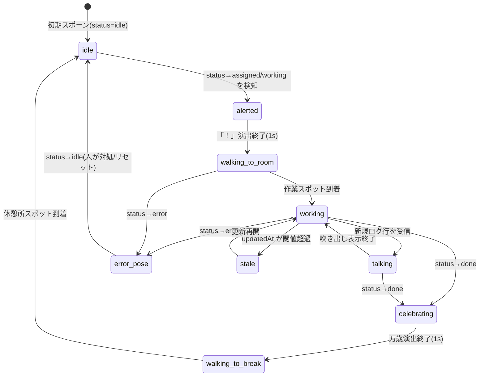

# 02. データ / 状態モデル設計 — Agent Village Dashboard

キャラクター表現（`01-visual-concept.md`）を駆動するためのデータモデルと状態遷移の設計。ここで定義するスキーマは将来のフロントエンド/監視サーバー（`03-tech-recommendation.md`）が読み込む契約（コントラクト）であり、本フェーズでは実装しない。

---

## 1. データソースの全体像

| ソース | 場所 | 性質 | 更新頻度 |
|---|---|---|---|
| エージェント定義 | `.claude/agents/*.md`（YAML frontmatter + 本文） | 静的（人が編集） | まれ |
| ランタイム状態 | `agents/state/*.json`（1 エージェント 1 ファイル） | 動的（実行系が書く） | 高頻度（秒単位） |
| 表示設定 | `config/rooms.json` 等（部屋マッピング・パレット） | 静的 | まれ |

フロントエンドはこの 3 つを合成して「キャラクター表示モデル」を組み立てる。**定義（誰がいるか）と状態（何をしているか）を分離**するのが本設計の骨子。定義があるのに状態ファイルがないエージェントは `idle` とみなす。

```
.claude/agents/coder.md ─┐
                          ├─(merge by agent id)→ CharacterViewModel → 描画
agents/state/coder.json ─┘
```

---

## 2. キャラクターを駆動するために必要なデータ項目

フロントエンド内部で保持する統合モデル（ViewModel）。TypeScript 風のインターフェース定義で示す（実装コードではなく契約の記述）。

```ts
interface AgentCharacter {
  // ===== 同一性 =====
  agentId: string;          // frontmatter name をスラッグ化したもの。定義と状態の突合キー
  displayName: string;      // 表示名（frontmatter name そのまま）

  // ===== 定義由来（静的） =====
  role: RoleId;             // "coder" | "reviewer" | "researcher" | "designer"
                            //  | "tester" | "documenter" | "planner" | "ops" | "generic"
  roomId: string;           // role → 部屋のマッピング結果（config/rooms.json 参照）
  description: string;      // frontmatter description（詳細パネル表示用）
  model?: string;           // "opus" | "sonnet" | "haiku" など
  color?: string;           // frontmatter color（パレットスワップの元）
  tools?: string[];         // frontmatter tools（詳細パネル表示用）

  // ===== 状態由来（動的） =====
  status: AgentStatus;      // "idle" | "assigned" | "working" | "done" | "error"
  currentTask?: {
    taskId: string;
    title: string;          // 吹き出し・一覧に出す 1 行タイトル
    startedAt: string;      // ISO 8601
  };
  progressLog: LogEntry[];  // 進捗ログ（詳細パネル + 吹き出しの供給源）
  lastUpdatedAt: string;    // 状態ファイルの最終更新時刻（鮮度判定に使用）

  // ===== 表示専用（フロントが導出。永続化しない） =====
  visualState: VisualState; // "idle" | "walking_to_room" | "working" | "talking"
                            //  | "celebrating" | "walking_to_break" | "error" | "stale"
  position: { x: number; y: number };   // タイル座標
  facing: "up" | "down" | "left" | "right";
  targetSpot?: string;      // 移動先スポット ID（例 "room-coding/desk-1"）
}

interface LogEntry {
  ts: string;               // ISO 8601
  level: "info" | "warn" | "error" | "result";
  text: string;             // エージェントの実際の出力/ログ（1 行分）
}
```

要点:

- **`status`（データ上の状態）と `visualState`（見た目の状態）を分離する。** 例: `status` が working に変わっても、キャラは部屋まで歩き終えてから `working` の見た目になる。歩行・帰宅はフロント側だけの中間状態であり、状態ファイルには存在しない。
- `position`/`facing` は永続化しない。リロード時は status に応じて「あるべき場所」（idle→休憩所、working→部屋の作業スポット）へ即時スポーンする。
- `progressLog` の最新行が `talking` 演出（吹き出し）のトリガになる。

---

## 3. `.claude/agents/*.md` frontmatter からのマッピング

### 3.1 入力フォーマット（Claude Code 規約）

```markdown
---
name: code-reviewer
description: Reviews diffs for correctness bugs and style issues. Use after code changes.
model: sonnet
color: red
tools: Read, Grep, Glob
---
（本文: システムプロンプト。ダッシュボードでは詳細パネルの折りたたみ表示のみに使う）
```

### 3.2 部屋推定（name / description → roomId）※実装により更新

> **更新履歴**: 当初案では「ロール(RoleId)は固定8種のenum、部屋と1:1」という設計だったが、部屋のリネーム・追加・削除をユーザーがダッシュボードから行えるようにする際、固定enumのままだと部屋を消すとそのロールのエージェントの行き場がなくなる問題があった。そのため **ロールという別概念を廃止し、キーワード判定ルールを部屋オブジェクト自身が持つ** 形に統合した。以下は実装済みの内容。

`role-rules.json` は廃止され、`server/src/config/rooms.json` の各部屋オブジェクトが `keywords` を直接持つ。部屋は固定リストではなく **ユーザーがダッシュボードの「部屋」タブからいつでも追加・削除・改名できる可変データ**。

```jsonc
// server/src/config/rooms.json（実装済み）
{
  "layout": { "columns": 3, "cellWidth": 140, "cellHeight": 120, "gap": 14 },
  "breakRoom": { "id": "break", "label": "休憩所" },
  "genericDesk": { "label": "フリーデスク" },
  "rooms": [
    { "id": "reviewer", "label": "レビュー部屋", "keywords": ["review", "audit", "critique", "レビュー"] },
    { "id": "coder",    "label": "コーディング部屋", "keywords": ["code", "implement", "fix", "refactor", "build", "実装"] }
    // ... ユーザーが追加/削除する分だけ増減する
  ]
}
```

- 判定対象は `name` + `description` の結合文字列。大文字小文字は無視。`rooms` 配列の**順序が優先度**（先にマッチした部屋を採用）。
- frontmatter の任意拡張フィールド `room: <roomId>` があれば、キーワード判定より優先する（Claude Code は未知のフィールドを無視するため互換性の問題はない）。存在しない `roomId` を指定した場合はフリーデスク扱い。
- どの部屋にもマッチしない場合はフリーデスク（`genericDesk`）に配置される。**部屋が削除された場合も同じ経路をたどるため、行き場を失うエージェントは発生しない**（次にマッチする部屋、無ければフリーデスクへ自動的に流れる）。
- 部屋数が変わると `server/src/lib/layout.js` がグリッド（列数固定・行数可変）とキャンバスサイズを再計算し、休憩所は常にグリッド中央付近に再配置される。

### 3.3 `color` → キャラパレット

frontmatter `color`（Claude Code の UI 色: red / blue / green / yellow / purple / orange / pink / cyan）を服メイン色のパレットスワップに使う。原色をそのまま使わず、レトロ調整済みの対応表を持つ。

```jsonc
// config/palette.json（案）
{
  "red":    { "main": "#b13e53", "shade": "#73273a" },
  "blue":   { "main": "#3b5dc9", "shade": "#29366f" },
  "green":  { "main": "#38b764", "shade": "#257179" },
  "yellow": { "main": "#ffcd75", "shade": "#b8860b" },
  "purple": { "main": "#7b4dbb", "shade": "#4a2d80" },
  "orange": { "main": "#ef7d57", "shade": "#a5453a" },
  "pink":   { "main": "#e06f9d", "shade": "#9c4670" },
  "cyan":   { "main": "#41a6f6", "shade": "#2b6cb0" },
  "_default": { "main": "#94b0c2", "shade": "#566c86" }   // color 未指定
}
```

- `color` 未指定時は `_default`（グレー系）とし、**同一ロール内で未指定が複数いる場合は agentId のハッシュから決定的に色を割り当てる**（リロードで色が変わらないこと）。

### 3.4 その他フィールドのマッピング

| frontmatter | 反映先 |
|---|---|
| `name` | agentId（スラッグ化）、名前ラベル、詳細パネル |
| `description` | ロール推定の材料、詳細パネルの説明文 |
| `model` | 頭上の★数: opus=★★★, sonnet=★★, haiku=★（未知/未指定=表示なし） |
| `tools` | 詳細パネルにチップ表示。v2: 代表ツールを持ち物アクセサリに反映（例: Bash 多用→工具） |
| 本文 | 詳細パネルの「プロンプトを見る」折りたたみ |

---

## 4. `agents/state/*.json` ランタイム状態スキーマ案

### 4.1 ファイル配置と命名

- パス: `agents/state/<agentId>.json`（1 エージェント 1 ファイル）。
- `<agentId>` は定義側の name のスラッグと一致させる（例: `.claude/agents/code-reviewer.md` → `agents/state/code-reviewer.json`）。
- 書き込み側の義務: **テンポラリファイルに書いてからリネームする（アトミック書き込み）**。フロントが書きかけ JSON を読む事故を防ぐ。パース失敗時、フロントは前回値を保持し 1 回分スキップする。

### 4.2 スキーマ（v1）

```jsonc
{
  "schemaVersion": 1,
  "agentId": "code-reviewer",
  "status": "working",              // "idle" | "assigned" | "working" | "done" | "error"
  "updatedAt": "2026-07-11T04:23:11.500Z",

  "task": {                          // status が idle のとき null
    "taskId": "t-20260711-0042",
    "title": "PR #12 の差分レビュー",
    "assignedAt": "2026-07-11T04:20:01Z",
    "startedAt": "2026-07-11T04:20:05Z",
    "progress": 0.6                  // 0..1、不明なら null（バーは非表示）
  },

  "log": [                           // 直近 N 件のみ保持（推奨 50 件、appendのみ）
    { "ts": "2026-07-11T04:21:00Z", "level": "info",   "text": "diff を取得しました (3 files)" },
    { "ts": "2026-07-11T04:22:10Z", "level": "warn",   "text": "テスト未更新の変更を検出" },
    { "ts": "2026-07-11T04:23:11Z", "level": "info",   "text": "src/api.ts をレビュー中…" }
  ],

  "result": null                     // status=done/error のとき要約を格納
  // 例: { "ok": true, "summary": "指摘 2 件。詳細は findings 参照", "finishedAt": "..." }
}
```

設計上の決定事項:

| 論点 | 決定 | 理由 |
|---|---|---|
| 1 ファイル/エージェント vs 単一ファイル | 1 ファイル/エージェント | 書き込み競合がない。ファイル監視で「どのエージェントが変わったか」が即分かる |
| ログの持ち方 | 状態ファイル内に直近 50 件 | フロントの要件は「最新の吹き出し + 直近パネル表示」。全量ログは将来 `agents/logs/<agentId>.ndjson` に分離（v2） |
| `status` の語彙 | idle/assigned/working/done/error の 5 値 | 見た目の中間状態（歩行）はフロント導出とし、書き込み側の負担を減らす |
| done の寿命 | done は書き込み側が一定時間後（またはタスク受領時）に idle へ戻す。フロントは done を見たら祝→帰宅演出を 1 回だけ再生 | 演出の重複再生を防ぐため、フロントは taskId ごとに再生済みフラグを持つ |
| 時刻 | すべて UTC ISO 8601 | 表示時にローカライズ |
| 破損耐性 | schemaVersion 必須。未知フィールドは無視 | 前方互換 |

### 4.3 サンプル: アイドル状態

```jsonc
{
  "schemaVersion": 1,
  "agentId": "researcher",
  "status": "idle",
  "updatedAt": "2026-07-11T04:00:00Z",
  "task": null,
  "log": [],
  "result": null
}
```

### 4.4 鮮度（ステイル）の扱い

- `status=working` なのに `updatedAt` が **120 秒以上更新されない**場合、フロントは表示上 `stale` とみなし、キャラに「Zzz」演出（01 §4 の `paused`）+ 一覧に鮮度警告を出す。データ上の status は変更しない。
- プロセス異常終了で error すら書かれないケースを、この鮮度判定が拾う。閾値は設定可能にする。

---

## 5. 状態遷移（ステートマシン）

### 5.1 表示ステートマシン（フロントエンド導出）

データ上の `status`（5 値）を入力イベントとして、表示状態 `visualState` を遷移させる。



### 5.2 遷移表（正準定義）

| 現在の visualState | イベント | 次の visualState | 演出・副作用 |
|---|---|---|---|
| idle | status=assigned or working | alerted | 頭上「！」1 秒。目的部屋と作業スポットを予約 |
| alerted | 演出終了 | walking_to_room | 経路探索開始（A* / BFS、タイルグリッド） |
| walking_to_room | 到着 | working | 作業ループアニメ開始。スポットを占有登録 |
| walking_to_room | status=done（歩行中に完了） | celebrating | その場で祝→帰宅（部屋に寄らないショートカット許可） |
| working | log 追加 | talking | 吹き出し表示（01 §5）。作業アニメは継続 |
| talking | 吹き出し終了 | working | — |
| working / talking | status=done | celebrating | 「✓」+ 万歳 1 秒。完了吹き出し（result.summary） |
| celebrating | 演出終了 | walking_to_break | 休憩所の空きスポットを予約して移動 |
| walking_to_break | 到着 | idle | スポット解放。アイドル行動ループ再開 |
| any(idle 以外) | status=error | error_pose | 汗マーク + 点滅。部屋入口へ移動して立ち尽くす |
| error_pose | status=idle | idle | 通常復帰 |
| working | 鮮度切れ(120s) | stale | Zzz 表示。status 更新が来たら working へ復帰 |
| any | 定義ファイル削除 | （消滅） | フェードアウト（1 秒）して除去 |
| — | 定義ファイル追加 | idle | 休憩所の入口からフェードイン（歩いて入場すると尚良い） |

### 5.3 タイミング規則

- **データ更新より演出を優先しない**: status が一気に idle→working→done と飛んでも、歩行を省略せず「早送り」（移動速度 2 倍）で追いつかせる。3 段以上先行された場合のみ演出をスキップしてワープさせる。
- 吹き出しキュー、スポット予約（同室複数体）、演出済み taskId の管理はフロントのローカル状態とし、永続化しない。

---

## 6. フロントエンドが読むための取得契約（概要）

実装詳細は `03-tech-recommendation.md` に譲るが、データ契約として以下を定める。

| 操作 | 内容 |
|---|---|
| 初期スナップショット | 全定義 + 全状態ファイルをまとめて取得（`GET /api/snapshot` 相当） |
| 差分通知 | 「agentId + 種別（definition/state）+ 新内容」のイベント（SSE 相当）。フロントは agentId 単位で置き換え |
| 削除通知 | 定義ファイル削除 → キャラ消滅、状態ファイル削除 → idle 扱い |

```jsonc
// 差分イベントのペイロード案
{
  "kind": "state",                  // "definition" | "state"
  "agentId": "code-reviewer",
  "change": "updated",              // "added" | "updated" | "removed"
  "payload": { /* 4.2 のスキーマ or frontmatter 抽出結果 */ }
}
```
