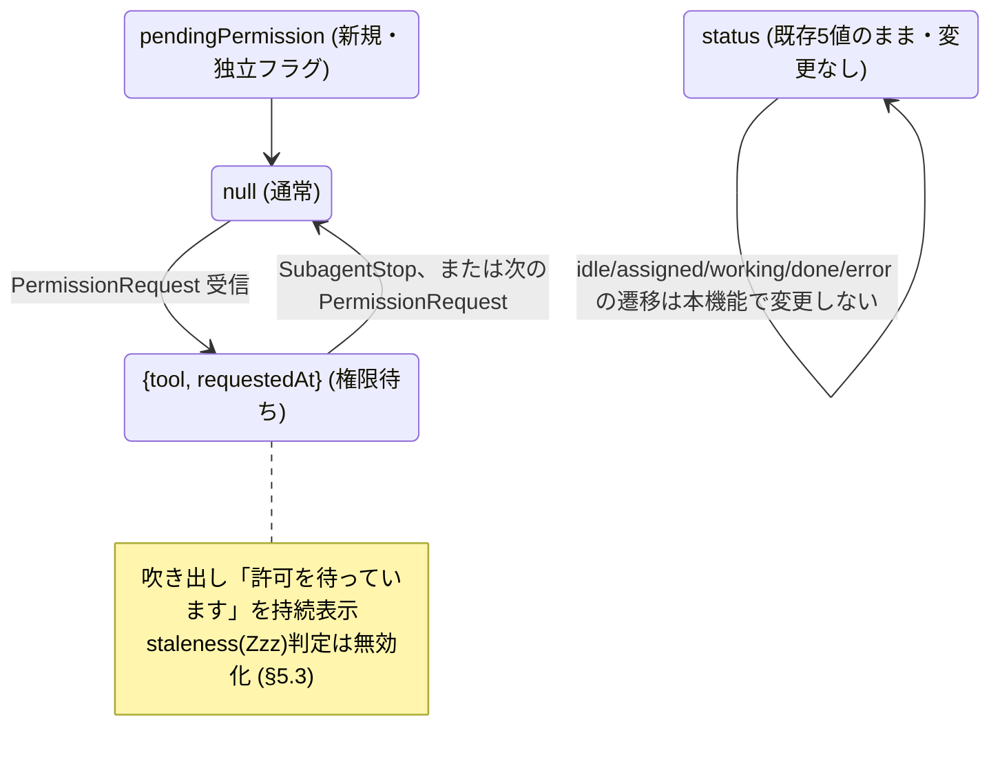

# 06. 権限待ち吹き出し（Permission Wait Bubble） — Agent Village Dashboard

エージェントがツール実行の許可（パーミッション）待ちで停止している間、それをキャラクター頭上の吹き出しで「許可を待っています」と表示する機能の設計。

対象読者: `bin/agent-village-hook.js` / `public/js/game.js` の実装者。
関連ドキュメント: `02-agent-state-model.md`（状態モデル。本機能はこれを拡張する）、`05-hooks-state-writer.md`（既存hook統合。本機能の実装方針は05の方針を踏襲する）。

**実装状況**: Phase 1・2 実装済み（本セッションで実装）。`agents_app`自身の`.claude/settings.local.json`に`PermissionRequest`フックを追加登録済みなので、次に実際の許可ダイアログが発生した際にPhase 0（`agent_type`の有無、§7.1の安全要件）が自然に検証される。合成ペイロードでの検証は完了（§10）。**ブラウザでの見た目の確認も2026-08-14に完了**（§10 Phase 3）。持続表示の吹き出し・一覧の点滅ドット・ドロップダウンの3点とも実装通りに動作することを実機ブラウザで確認済み。残るのは実際のClaude Codeセッションでの許可ダイアログ発生時の実地確認（Phase 0後半）のみ。

---

## 1. 背景・目的

Claude Codeは、Bash実行など許可が必要なツール呼び出しの直前でダイアログを出し、ユーザーの承認/拒否を待って**セッション全体を停止**する。これはサブエージェント（Agent Villageが可視化する対象）がツールを呼んだ場合も同様で、公式ドキュメントによれば v2.1.186 以降はメインセッション側にダイアログが出て「どのサブエージェントが尋ねているか」が名前で示される。

現状の Agent Village はこの「停止中」を一切表現できない。`status` は `idle/assigned/working/done/error` の5値のみで（`02-agent-state-model.md` §2, §4.2）、権限待ちの間もキャラクターは単に `working` の作業アニメを続けて見える（`public/js/game.js` の `setWorkingAnim`）。**ユーザーはターミナル側を見ない限り、自分の承認待ちで止まっていることに気づきにくい。**

本機能のゴール: 権限待ちが発生したら、該当キャラクターの頭上吹き出しに固定文言「許可を待っています」を表示し、解消されるまで消えないようにする。

## 2. スコープ

**やること**
- 権限待ち状態をランタイム状態ファイル（`agents/state/*.json`）に反映する新フィールドの追加
- キャラ頭上の吹き出しに「許可を待っています」を**持続表示**（既存の吹き出しは`BUBBLE_MS`=3400msで自動的に消えるが、権限待ちは解消されるまで消してはならない）
- 一覧パネルの該当エージェント名の横に点滅インジケータを表示し、展開すると「何の許可を待っているか」をドロップダウンで見せる（§5.4）。ヘッダーにも同じ状態を軽く反映（§8）

**やらないこと（明示的にスコープ外）**
- ダッシュボード（ブラウザ）から承認/拒否を操作できるようにすること。Agent Villageはあくまで観察用の可視化ツールであり、Claude Code本体の承認フローに介入しない。
- 新しいスプライトポーズ/アニメーションフレームの追加。既存の作業アニメ＋吹き出しのみで表現する。
- 権限待ち以外の「通知」全般（アイドル通知、認証待ちなど）への対応。今回はツール実行の許可待ちに限定する。

## 3. 前提調査: Claude Code hooksの仕様（未実測・要検証）

`05-hooks-state-writer.md` は「ドキュメントを鵜呑みにせず実測する」方針を徹底していた（同ドキュメント§1）。本セクションはその実測を**まだ行っていない**段階のドキュメント調査結果であり、§10 Phase 0で実測するまで確定情報として扱わない。

| 論点 | 現時点の調査結果 | 確度 |
|---|---|---|
| 権限ダイアログ表示時に発火するhookはあるか | `PermissionRequest` フックが「許可ダイアログを表示する直前」に発火する（hooksガイドに記載あり）。より広い `Notification`（`permission_prompt` マッチャー）も存在するが、アイドル通知等も含み対象が広すぎるため今回は不採用 | 中（公式ドキュメント記載を確認したが、`agents_app`環境での実測はまだ） |
| ペイロードにサブエージェントを特定できる情報があるか | `session_id` / `tool_name` / `tool_input` / `tool_use_id` / `permission_details` / `permission_mode` は確認できた。**`agent_id` / `agent_type` が含まれるかは公式ドキュメントで明記されておらず不明** | **低（要実測。§6でフォールバック方針を用意）** |
| 承認/拒否が確定した時に発火するhookはあるか | 存在しない。承認された場合は後続の `PostToolUse` が信号になるが、**ユーザーが手動で拒否した場合は何のhookも発火しない**（`PermissionDenied` は自動モードによる自動拒否専用で、手動拒否では発火しない） | 中 |
| サブエージェントのツール呼び出しでも同様に発火するか | サブエージェントはデフォルトで親セッションの権限設定を継承するため、親が対話的モードなら子の呼び出しでも同様にダイアログが出る（v2.1.186+でメインセッションにサブエージェント名付きで表示される） | 中 |

この不確実性のうち最重要なのは2番目（`agent_id`の有無）で、これが無いと「どのキャラクターの頭上に吹き出しを出すか」が決められない。§6で両パターンの対応方針を用意する。

## 4. データモデルへの追加

`02-agent-state-model.md` §4.2 のスキーマに、**既存の5値`status`とは独立したオーバーレイフィールド**として追加する（新しい`status`の値は増やさない。理由は§5.1）。

```jsonc
{
  "schemaVersion": 1,          // 追加フィールドは既存の「未知フィールドは無視」方針で後方互換。バージョンは上げない
  "agentId": "code-reviewer",
  "status": "working",
  "updatedAt": "2026-07-27T09:12:03Z",
  "task": { /* ... 既存のまま ... */ },
  "log": [ /* ... 既存のまま ... */ ],
  "result": null,

  "pendingPermission": {        // 権限待ちでなければ null（省略可）
    "tool": "Bash",             // PermissionRequest の tool_name
    "requestedAt": "2026-07-27T09:12:03Z"
  }
}
```

`AgentCharacter`（ViewModel、02 §2）にも同名で1フィールド追加するのみで、既存の`status` / `visualState`の型は変更しない。

## 5. 状態への統合方針

### 5.1 なぜ新しい`status`値ではなく「オーバーレイ」にするのか

| 案 | 内容 | 採用しない理由 |
|---|---|---|
| A. `status`に`"waiting_permission"`を追加（6値化） | 権限待ち中は他の値を排他的に上書き | 解消後に「元がidleだったのかworkingだったのか」を復元する必要が生じ、遷移表（02 §5.2）全体に分岐が増える。権限待ちは「今workingの何かに割り込んでいる」だけで、根本のタスク状態は変わっていない |
| **B.（採用）`pendingPermission`を独立フィールドにする** | `status`はそのまま（実質常に`working`）、吹き出し表示だけが`pendingPermission`の有無で決まる | 既存の「鮮度切れ(stale)」判定（02 §4.4）も同じ考え方で`status`を変えずフロント側の見た目だけ変える前例があり、一貫性がある |

### 5.2 表示ロジック（フロントエンド）

- `pendingPermission`が非nullの間、頭上の吹き出しは**固定文言「許可を待っています」を持続表示**する。既存の吹き出し（`public/js/game.js`の`showBubble`）は表示後`BUBBLE_MS`(3400ms)で自動的に消えるが、権限待ちの間はこのタイマーを止める。
- `pendingPermission`がnullに戻った瞬間、吹き出しを消す（直後に新しいログがあれば通常の吹き出し表示に切り替える）。
- 吹き出しの見た目は既存の9-sliceデザイン（`01-visual-concept.md` §5.2、4種類）に**5番目の種類「許可待ち」**を追加する: 白地・黄枠＋🔒アイコン。他4種と違い**自動的に消えない**点が唯一の例外。枠色は`--permission`(`#ffcd75`、既存の`--assigned`と同系)を基準にしつつ、白地の吹き出し上では視認性のため実装上は少し濃い`#e0a93a`を採用（一覧側のドット/ドロップダウンは暗いパネル背景の上なので`#ffcd75`のまま使う）。
- 一覧パネル（`public/js/hud.js`）の表示は§5.4（点滅インジケータ＋ドロップダウン）で扱う。新しいCSS状態クラス（`.status-*`）は追加せず、既存の`.status-label`周辺に追加要素を足すだけに留める。

### 5.3 鮮度判定(stale)への影響

`02-agent-state-model.md` §4.4の「`status=working`のまま`updatedAt`が120秒更新されない→stale(Zzz)」判定は、**`pendingPermission`が立っている間は適用しない**。権限待ちは人間の応答を待つ設計上正常な長時間停止であり、Zzz（異常っぽい停止）と同時に出すと矛盾したメッセージになる。

### 5.4 一覧パネルの表示: 点滅インジケータ＋ドロップダウン

> **更新履歴**: 当初は「状態ラベルの横に🔒アイコンを1つ出す程度」という最小限の案だったが、マップを見ていなくても一覧だけで「誰が」「何の許可を」待っているかに気づけたほうがUXが良い、というユーザーからの提案を受けて以下の仕様に拡張した。

`pendingPermission`は`tool`と`requestedAt`を既に持っているため、**スキーマ変更は不要**。`public/js/hud.js`の`renderAgentList`にのみ手を入れる。

- **点滅インジケータ**: `pendingPermission`が非nullの間、一覧のエージェント名の右に小さい点（8px程度）を表示し、CSSアニメーションでゆっくり明滅させる（1.4秒周期程度）。`01-visual-concept.md` §4はエラー時にもキャラを点滅させる設計意図を記しているが、**現状の`public/js/game.js`は静的な色変更のみで点滅は未実装**。本機能で一覧に新規実装する点滅は、将来エラー側が実装されたときと合わせて「注意を引く」演出を権限待ちとエラーの2状態だけに絞る（多用すると注意サインとして機能しなくなる）。
- **ドロップダウン**: 一覧項目に開閉用のキャレット（▾）を追加し、展開すると「🔒 `<tool>` の実行許可を待っています ・ `<経過時間>`経過」を1行表示する。経過時間は`requestedAt`からフロント側で計算する（新しいデータは不要）。既定は閉じた状態（点滅ドットだけで気づける）にし、複数エージェントが同時に待っていても一覧が縦に伸びすぎないようにする。
- **アクセシビリティ**: `prefers-reduced-motion: reduce`環境では点滅アニメーションを無効化し、静的なドット表示にフォールバックする。
- **ノイズ対策**: 点滅は該当エージェントのインジケータ要素にのみ適用し、行全体やキャラクター本体（ゲーム画面側）は点滅させない。

## 6. `agent_id`が取れない場合のフォールバック方針

`05-hooks-state-writer.md` §3.2は「情報が少なくても常に正しい」を「情報は豊富だが時々間違う」より優先する、という原則を確立していた。本機能もこれを踏襲する。

| §10 Phase 0の実測結果 | 対応 |
|---|---|
| **Case A**: `PermissionRequest`のpayloadに`agent_id`（または`agent_type`）が確認できた | 想定通り実装。`slugify(agent_type)`で`agents/state/<id>.json`に`pendingPermission`を書く（`agent-village-hook.js`の既存の突合ロジックを再利用） |
| **Case B**: 確認できない（`session_id`しか無い等） | **キャラクター単位の吹き出しは出さない。**「今どのエージェントか」を推測（例: 直近にSubagentStartしたエージェント、と決め打ち）するのは、並行実行時に別のキャラの頭上に間違って表示するリスクがあり、「間違えて表示する」方が「何も表示しない」より悪いと判断する。代わりに§8の**HUDヘッダーの全体バナー**（「🔒 権限承認待ち: Bash」）にフォールバックする |

Case Bのフォールバックはキャラクター単位の表示ではなくなるため、本来の要望（頭上の吹き出し）を完全には満たせない。その場合は改めて実装方針をユーザーに確認する。

## 7. フック統合方針（実装時の指針）

- 新規に`PermissionRequest`のみ登録する。`PostToolUse`（権限確定＝解消の検知に使えそうだが、**全ツール呼び出しで毎回発火する**ため、対象プロジェクトの通常のツール呼び出し全てにhookの実行コスト（05実測で1回あたり約0.3秒）を上乗せしてしまう）は登録しない。既存の`SubagentStart`/`SubagentStop`限定というhook足跡の小さい方針（04・05）を維持する。
- `PermissionRequest`はもともとダイアログ表示前＝ユーザーがどうせ一旦止まる場面で発火するため、hook自体の実行に数百msかかっても実害が小さい（`PostToolUse`と違い連続ツール呼び出しの間に挟まらない）。
- 解消（`pendingPermission`をnullに戻す）のトリガーは以下のみに限定する:
  1. 同じエージェントの次の`SubagentStop`（タスク終了）
  2. 同じエージェントの次の`PermissionRequest`（別のツールで再度発生＝内容を上書き）
- **既知の残存ケース**: ユーザーが手動で拒否し、かつそのサブエージェントがその後何のツールも呼ばず`SubagentStop`にも至らない場合、`pendingPermission`は次のhook発火まで残り続ける。これは`PostToolUse`を全面登録するコストと比較して許容する（`05-hooks-state-writer.md` §4の既知の限界と同じ扱い方）。

設定例（`.claude/settings.local.json`、案）:

```jsonc
{
  "hooks": {
    "PermissionRequest": [
      { "matcher": "", "hooks": [{ "type": "command", "command": "node \"<agents_app>/bin/agent-village-hook.js\"" }] }
    ]
  }
}
```

### 7.1 実装上の絶対要件（安全性・要確認済み）

`PermissionRequest`は`SubagentStart`/`SubagentStop`と違い、**単なる通知ではなく承認/拒否の決定そのものを返せるフック**である（公式ドキュメント `hooks.md` の `PermissionRequest` / Hook Outcome Determination の記載で確認済み）。決定は`stdout`に`{"hookSpecificOutput":{"hookEventName":"PermissionRequest","decision":{"behavior":"allow"|"deny"}}}`形式のJSONを書くことで行われる。さらに**exit code 2を返すと権限プロンプト自体がユーザーに表示されなくなる**（ブロッキングエラー扱い）という強い副作用がある。

一方、以下は公式に保証されている（安全なフォールバック）:

| フックの振る舞い | 結果 |
|---|---|
| `stdout`に何も書かない、または`decision`フィールドを含まないJSON、かつ exit code 0 | サイレント扱い。通常の承認ダイアログがそのままユーザーに表示される（**安全**） |
| exit code 2 | ブロッキングエラー。権限プロンプトが**表示されなくなる**（**危険・footgun**） |
| exit code 0以外（2を除く）やタイムアウト(既定600秒) | 非ブロッキングエラー。通常の承認ダイアログが表示される（安全） |

したがって`bin/agent-village-hook.js`の`PermissionRequest`ハンドラは、**観察用（ログ書き込みのみ）という役割を絶対に超えないこと**を実装時の必須制約とする:

1. `stdout`には何も書かない（`process.stdout.write`を一切呼ばない）
2. 例外は`SubagentStart`/`SubagentStop`の既存ハンドラと同じパターンで握りつぶし、**exit code は常に0**にする（`main().catch()`内で`process.exit()`を呼ばない。現状のコードは既にこの規律に従っている）
3. `agents/state/*.json`への書き込みは既存の`atomicWrite`をそのまま再利用し、新しい書き込み経路を増やさない

この3点が守られていれば、本フックが実際の承認ダイアログを消したり自動承認したりすることは**構造的に起こり得ない**。

## 8. HUDヘッダーへの補助表示（Case Bフォールバック用、および視認性強化）

権限待ちはユーザーの直接対応を要する点で`error`より優先度が高いと言える。マップを見ていなくても気づけるよう、`01-visual-concept.md` §6.1のヘッダーバッジ列に一つ追加する:

```
[Idle 3 | Work 2 | 🔒待ち 1 | Err 0]
```

Case A（キャラ単位で表示できる場合）でもこのバッジは残す。マップ上の吹き出しと併用してよい（互いに矛盾しない）。

## 9. 図解

### 9.1 データフロー（シーケンス）

```mermaid
sequenceDiagram
    participant CC as Claude Code (対象プロジェクトのセッション)
    participant Hook as agent-village-hook.js
    participant State as agents/state/&lt;id&gt;.json
    participant Server as agent-village server (watch + SSE)
    participant UI as ブラウザ (game.js)

    CC->>CC: サブエージェントがBash等の許可要ツールを呼ぶ
    CC->>Hook: PermissionRequest フック発火 (stdin JSON)
    Hook->>State: pendingPermission = {tool, requestedAt} を書き込み (atomic)
    State-->>Server: ファイル変更を検知
    Server-->>UI: SSEで差分通知
    UI->>UI: 吹き出し「許可を待っています」を持続表示 (タイマー無し)
    Note over CC: ユーザーがターミナルで承認/拒否するまで停止
    CC->>Hook: (承認後、後続ツール呼び出し or SubagentStop)
    Hook->>State: pendingPermission = null に更新
    State-->>Server: ファイル変更を検知
    Server-->>UI: SSEで差分通知
    UI->>UI: 吹き出しを消す
```

### 9.2 オーバーレイとしての位置づけ



## 10. 実装ステップ案

| Phase | 内容 | 状況 |
|---|---|---|
| 0 | `agent_type`の有無・§7.1の安全要件を実機で確認する | **一部完了**。合成ペイロードでの検証は完了（下表）。`PermissionRequest`を実際の許可ダイアログで検証するのは、`agents_app`自身の`.claude/settings.local.json`に登録済みのフックが次回の実ダイアログ発生時に自然に検証する（強制的なトリガーは行わなかった） |
| 1 | `bin/agent-village-hook.js`に`PermissionRequest`ハンドラを追加し、`pendingPermission`の書き込み/クリアを実装 | **完了** |
| 2 | フロントエンド: `public/js/game.js`の`showBubble`/`applyAgentUpdate`に持続表示ロジックを追加。`public/js/hud.js`に一覧の点滅インジケータ・ドロップダウン（§5.4）を追加 | **完了**（ヘッダーバッジ§8は今回のスコープから外した。理由は下記） |
| 3 | 実際のClaude Codeセッションでの確認 | **ブラウザでの目視確認は完了**（2026-08-14、下表参照）。実際の許可ダイアログでの確認は**未実施**（次回発生時に自然検証） |

**Phase 2のスコープ調整**: §8のHUDヘッダーバッジ（Case Bフォールバック用）は、ユーザーから直接依頼された「頭上の吹き出し」「一覧の点滅＋ドロップダウン」の2点に実装を絞るため、今回は見送った。Case B（`agent_type`が取れない場合のフォールバック）自体もまだ発生が確認されていないため、実際に必要になった時点で改めて実装する。

**合成ペイロードでの検証結果（本セッションで実施）**:

| 検証内容 | 方法 | 結果 |
|---|---|---|
| `PermissionRequest`が`agents/state/<id>.json`に`pendingPermission`を正しく書き込むか | 実在するagent（`agent-dispatcher`）宛の合成JSONを`bin/agent-village-hook.js`に標準入力で投入 | ✅ 既存フィールド（status/task/log/result）を保持したまま`pendingPermission`が追加された |
| §7.1の安全要件（stdout無し・exit code 0） | 上記実行時の`stdout`/`stderr`/exit codeを確認 | ✅ すべて空・exit code 0 |
| `SubagentStop`が`pendingPermission`を解消するか | 同じagent宛の合成`SubagentStop`を投入 | ✅ `pendingPermission`キーが消え、`status: "done"`に遷移 |
| サーバ経由（`/api/snapshot`）で`pendingPermission`が見えるか | サーバをテスト用ポートで起動し確認を試みた | ⚠️ 前回セッションでは未確認だったが、**2026-08-14に解消**。下記ブラウザ確認と同時に、`agent-village`サーバ（`npm start`、`agents_app`自身を対象）にブラウザから到達できることを確認済み |
| ブラウザでの見た目（持続吹き出し・点滅ドット・ドロップダウン） | `agent-dispatcher`宛に`PermissionRequest`（`tool_name: "Bash"`）の合成ペイロードを`bin/agent-village-hook.js`に投入し、`http://localhost:4173`をブラウザで開いて目視確認 | ✅ **2026-08-14に完了**。①頭上に白地・黄枠＋🔒アイコンの吹き出し「Bashの実行許可を待っています」が表示され、`BUBBLE_MS`(3400ms)を超えて6秒以上待っても消えず持続表示された。②一覧の`agent-dispatcher`行に点滅ドットが表示された。③キャレットを開くと「🔒 Bashの実行許可を待っています・mm:ss経過」の経過時間表示（§11の`mm:ss`フォーマット）が確認できた。④続けて同エージェント宛に合成`SubagentStop`を投入したところ、吹き出し・点滅ドットとも即座に消え、状態が`done`に遷移した（§7の解消トリガー1点目の動作確認）。検証後、`agents/state/agent-dispatcher.json`は検証前のデモデータに復元済み |

## 11. 既知の限界（決め打ちしなかった/できなかった点）

| 項目 | 内容 |
|---|---|
| `agent_id`の有無が未確認 | §3・§6参照。Phase 0実測まで、キャラ単位表示が実現できるかどうか自体が未確定 |
| 手動拒否の検知不能 | ユーザーが手動で拒否した場合、後続hookが発火するまで`pendingPermission`が残り続ける（§7既知の残存ケース） |
| ダッシュボードからの承認操作不可 | スコープ外（§2）。観察のみ |
| `PostToolUse`非採用によるタイムラグ | 承認後すぐには消えず、次のSubagentStop/PermissionRequestまで持続表示が残ることがある（§7） |
| 経過時間表示のフォーマット | 一覧ドロップダウン（§5.4）の経過時間は`mm:ss`表記のため、長時間待ちだと`540:23`のような表記になる。実用上支障はないため今回は許容し、必要になれば`h:mm:ss`への切替をv2で検討する |
| サーバのbindアドレス（本機能固有ではない既存事項） | `server/src/index.js`の`app.listen(PORT, cb)`はホスト指定がなく既定で全インターフェースにbindされる。本機能で状態ファイルに追加する情報は`tool`名と時刻のみで、既にログや`task`に含まれている情報と同程度の機微度のため、本機能によって露出範囲が実質的に広がるわけではない |
