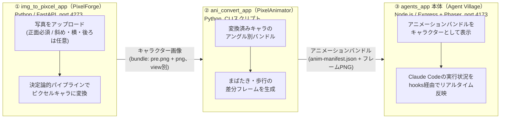
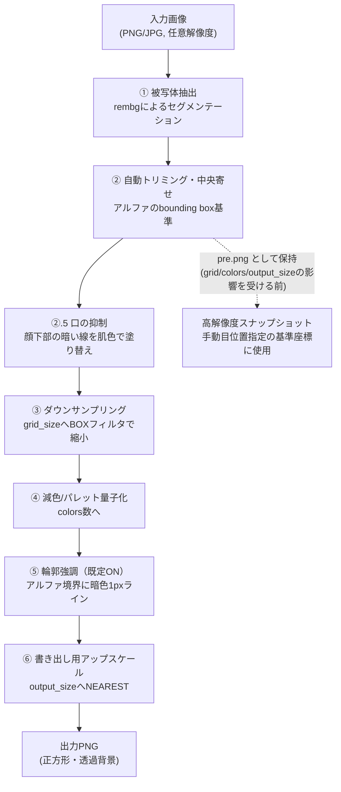
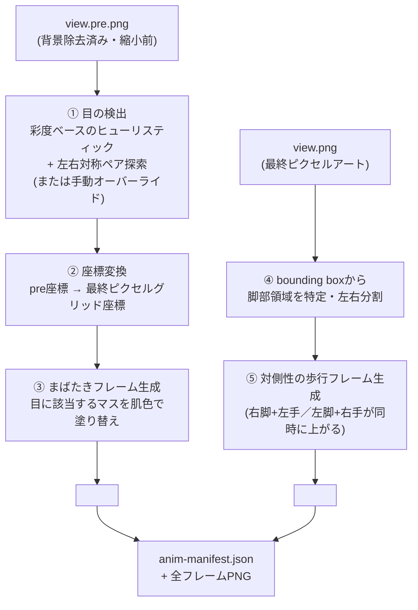
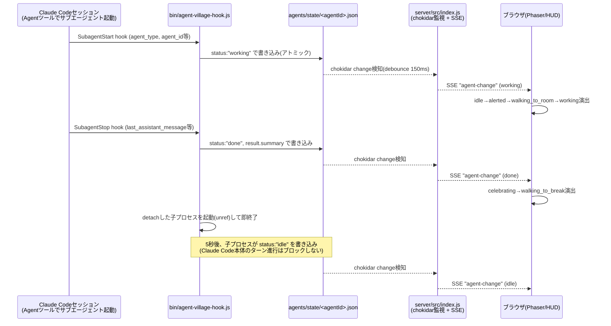
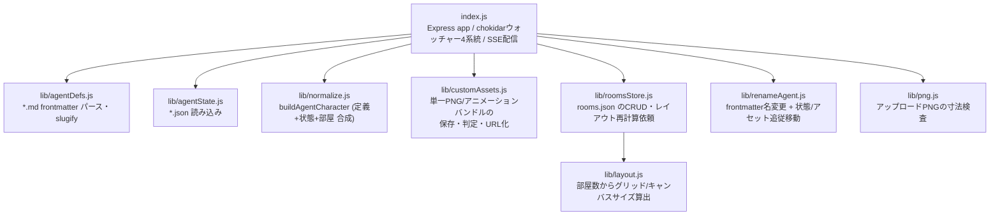
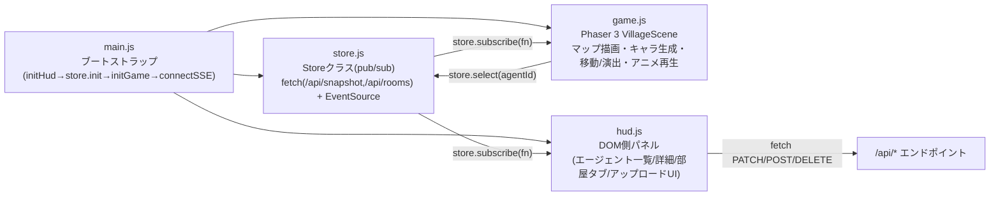
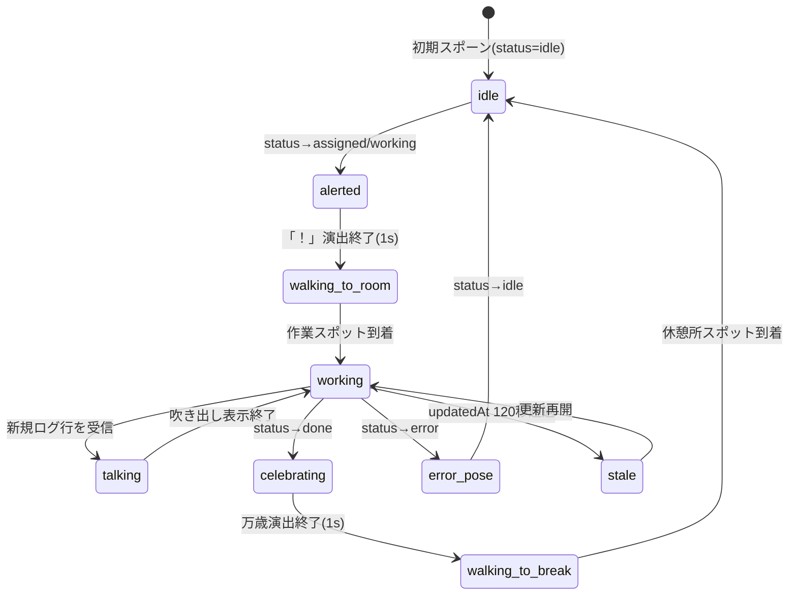
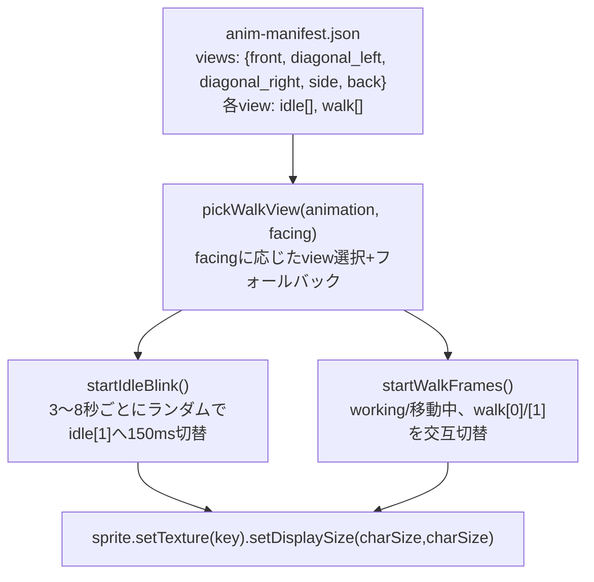
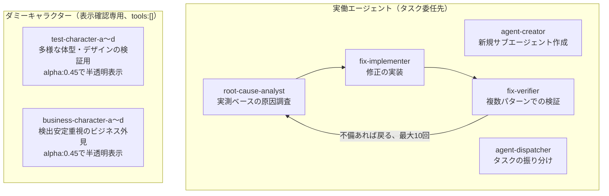

# システムアーキテクチャ図解（現状スナップショット）

対象読者: 次セッションでこのリポジトリに合流する実装者・エージェント。**「今の仕組みがどう繋がっているか」を図で把握するためのドキュメント**であり、変更履歴・不具合の詳細は扱わない（それらは `docs/project-status.md` と各サブプロジェクトの `docs/design/*.md` が正）。作成時点: 2026-08-31。

関連ドキュメント: `CLAUDE.md`（プロジェクト概要・検証ルール）、`docs/project-status.md`（時系列の詳細な引き継ぎ）、`docs/design/01〜07-*.md`（agents_app本体の個別設計）、`img_to_pixcel_app/docs/design/*.md`、`ani_convert_app/docs/design/*.md`。

---

## 1. 全体像：3プロジェクトのパイプライン

`D:\app\agents_app` はリポジトリ全体の名前であると同時に、パイプラインの最終段（③）自身の名前でもある（紛らわしいが実装済みの構造）。3つのサブプロジェクトはそれぞれ独立したプロセス・別言語で動き、**ファイルシステム経由**で疎結合に連携する。



| # | プロジェクト | 役割 | 言語/技術 | 実行形態 |
|---|---|---|---|---|
| ① | `img_to_pixcel_app` | 写真 → ピクセルキャラクター変換 | Python 3.10+ / FastAPI + Pillow + NumPy + `rembg` | `uvicorn app.main:app --port 4273` |
| ② | `ani_convert_app` | まばたき・歩行の差分フレーム生成 | Python（CLIスクリプト、サーバー無し） | `python -m app.bundle` 等をスクリプトから呼ぶ |
| ③ | `agents_app` 本体（Agent Village） | ダッシュボードでキャラクターを表示・アニメーション再生 | Node.js / Express + chokidar + SSE（サーバー）、Phaser 3（フロント） | `npm start`（自己デモ用）/ `agent-village`（他プロジェクト監視用CLI）、`--port 4173` |

3プロジェクトは同時起動が前提だが、**どれか単体でも完結して動く**（①はAgent Villageが無くても画像変換だけで使える。③は①②を経由しない手動アップロードのキャラでも表示できる）。

---

## 2. ① img_to_pixcel_app：変換パイプライン



- 主要パラメータは `grid_size`（32/64/128）・`colors`（8/10）・`output_size`（64/128）の3軸（**CLAUDE.mdの検証ルールがこの3軸×12パターンを必須化している**）。
- **複数アングル入力（フェーズ制）**: フェーズ1=正面のみ（必須）／フェーズ2=+斜め（左右別）／フェーズ3=+横向き+後ろ向き（フル）。アングルごとに独立してこのパイプラインを通す。
- `pre.png`（②終了時点、grid/colors/output_sizeの影響を受ける前の高解像度段階）を保持しておくことで、③側の「目の位置の手動指定」がどの設定でも同じ位置を指せる（§4.7参照）。

---

## 3. ② ani_convert_app：差分フレーム生成パイプライン



- 入力バンドルの `views`（front / diagonal_left / diagonal_right / side / back）**各アングルに対して独立に**実行する。
- 目の検出が困難なキャラクター向けに、`app/eye_overrides.py` による**手動オーバーライド**が使える（キャンバス比率で保存 → どの `grid_size`/`output_size` でも同じ位置を指す）。`scripts/paint_eye_positions.py`（matplotlib対話ツール）で座標を指定する。
- 出力はスプライートシートではなく**個別PNGファイル一式**（`anim-manifest.json` が views→フレーム配列の対応表）。この形式のまま③にアップロードする。

---

## 4. ③ agents_app 本体（Agent Village）の内部アーキテクチャ

### 4.1 データソースとマージモデル

```mermaid
flowchart LR
    subgraph Sources["データソース（ターゲットルート配下）"]
        DEF[".claude/agents/*.md<br/>(frontmatter: name/description/model/color/tools)<br/>静的・人が編集"]
        STATE["agents/state/*.json<br/>(status/task/log/result)<br/>動的・hooksが書く"]
        ROOMS["agents/config/rooms.json<br/>(部屋定義・キーワード・レイアウト)<br/>静的・HUDから編集可"]
        ASSETS["assets/custom/characters/<br/>(単一PNG or アニメーションバンドル)"]
    end

    DEF -->|agentId(slug)でマージ| MERGE["buildAgentCharacter()<br/>server/src/lib/normalize.js"]
    STATE -->|agentId(slug)でマージ| MERGE
    ROOMS -->|keywordマッチでroomId決定| MERGE
    ASSETS -->|spriteUrl / animation| MERGE

    MERGE --> VM["CharacterViewModel<br/>(status, roomId, animation, ...)"]
    VM -->|"GET /api/snapshot（初期）<br/>SSE agent-change（差分）"| FRONT["フロントエンド"]
```

- 「定義（誰がいるか）」と「状態（何をしているか）」を分離するのが設計の骨子。**定義はあるが状態ファイルが無いエージェントは `idle` 扱い**。
- `role`という固定enumは廃止済みで、各部屋オブジェクトが `keywords` を持ち、`name`+`description` に対してマッチした最初の部屋（配列順が優先度）に配属される。どこにもマッチしなければ `genericDesk`（フリーデスク）。

### 4.2 hooksによる状態自動反映（Claude Code実行 → 状態ファイル）



- 登録先は監視対象プロジェクトの `.claude/settings.json`（`SubagentStart`/`SubagentStop`、`matcher: ""` で全エージェント種別に一致）。
- hookは**タスクの説明文を持たせない**設計（`PreToolUse`のdescriptionと`SubagentStart`を安全に紐付ける手段が無いため）。`task.title` は `"<agent_type> を実行中"` の固定文言。
- 失敗（error）状態を検出する経路は無い（Stopペイロードに成否フィールドが無いため、常に `done` 扱い）。

### 4.3 サーバー内部構成（`server/src/`）



主なREST/SSEエンドポイント（`server/src/index.js`）:

| メソッド/パス | 役割 |
|---|---|
| `GET /api/snapshot` | 全エージェントの初期スナップショット |
| `GET /api/rooms` | 部屋定義+タイル画像URL |
| `GET /api/events` | SSE購読口（`agent-change`/`asset-change`/`rooms-changed`/`server-status`） |
| `PATCH /api/agents/:id/name` | エージェント名変更（状態・アセットも追従移動） |
| `POST`/`DELETE /api/agents/:id/sprite` | 単一PNGスプライートの差し替え/削除 |
| `POST`/`DELETE /api/agents/:id/animation` | アニメーションバンドル一式のアップロード/解除 |
| `POST`/`PATCH`/`DELETE /api/rooms[/:id]` | 部屋の追加/改名/削除 |
| `POST`/`DELETE /api/rooms/:id/tile` | 部屋タイル画像の差し替え/削除 |

- ファイル監視は `chokidar` で4系統（エージェント定義／状態／キャラクターアセット／部屋アセット）+ `rooms.json` 個別監視。変更はdebounce 150msで集約してから該当エージェントのみ再構築・SSE配信（全量再送しない）。
- **インストールルート（`__dirname`基準、ツール自身のコード）とターゲットルート（`--target`/`TARGET_PROJECT_ROOT`、可視化対象プロジェクト）を分離**しており、`agents_app` 自身を見るセルフデモは「ターゲット＝インストール」の特殊ケースとして両立する。

### 4.4 CLIエントリーポイント（`bin/`）

| ファイル | 役割 |
|---|---|
| `bin/agent-village.js` | `agent-village` コマンド本体。`--target`未指定時は `process.cwd()` を既定ターゲットにし、`AGENT_VILLAGE_AUTO_OPEN=1` でブラウザを自動起動 |
| `bin/agent-village-hook.js` | Claude Codeの `SubagentStart`/`SubagentStop` hookから呼ばれる実体（§4.2） |

`npm start`（生の開発エントリー、`server/src/index.js` を直接叩く）はブラウザ自動起動をしない。`agent-village` はする——開発中の再起動でタブが増殖しないようにする使い分け。

### 4.5 フロントエンド構成（`public/js/`）



- `store.js` は依存ゼロの単純なpub/subで、`game.js`（Phaser描画）と `hud.js`（DOM一覧・詳細パネル）の**唯一の共有状態源**。両者はSSE経由の差分を同じイベントで受け取る。
- 再接続時（`es.onopen`）は取りこぼし防止のため `store.init()` を呼び直してフルスナップショットを再取得する。
- 部屋の追加/改名/削除（`rooms-changed`イベント）だけは差分再計算せず、**ページ全体をリロード**する設計（レイアウト全体が変わるため、単純さを優先）。

### 4.6 キャラクター表示ステートマシン



- `status`（データ上の状態、5値）と `visualState`（見た目、フロント導出）を分離。歩行・帰宅は状態ファイルには存在しないフロント専用の中間状態。
- `working` 状態のキャラも、以前あった上下スクワッシュ（`scaleY`往復）演出は**撤去済み**——現在は `idle` と同じ緩やかな上下ボブ（`container.y`を3px, 700ms周期）に統一されている。

### 4.7 アニメーション再生（表情差分・歩行差分）



view選択の優先順位（`facing` ごと、無ければ次にフォールバック、**必ず `front` で止まる**）:

| 状態 | 優先view | フォールバック |
|---|---|---|
| 静止中 | `front` | — |
| 移動中・down | `diagonal_right` | `diagonal_left` → `front` |
| 移動中・up | `back` | `diagonal_right` → `diagonal_left` → `front` |
| 移動中・left | `side`(flipX=false) | `diagonal_left` → `diagonal_right`(反転) → `front` |
| 移動中・right | `side`(flipX=true) | `diagonal_right` → `diagonal_left`(反転) → `front` |

- `animation` フィールドが無いエージェントは従来通り `spriteUrl`（単一PNG）の静止表示、それも無ければプレースホルダー図形（色付き四角）——3段階の後方互換フォールバックになっている。
- 目の位置を自動検出できないキャラクターは、`ani_convert_app/app/eye_overrides.py` の手動オーバーライド（`ani_convert_app/scripts/paint_eye_positions.py`で指定）で救済する運用（§3参照）。

### 4.8 キャラクター表示サイズ（「休憩所セルの1/9」ルール）

```
this.charSize = Math.floor((Math.min(roomW, roomH) / 3) * 0.9)
```

- `roomW`/`roomH` は `agents/config/rooms.json` の `layout.cellWidth`/`cellHeight`（既定 140×120px）から取った休憩所セルの実サイズ。**休憩所セルを3×3に分割した1マス分**を表示サイズとする。
- `setTexture(key)` 呼び出し直後に必ず `setDisplaySize(charSize, charSize)` を呼び直す（Phaserは`setTexture()`だけでは拡大率を再計算しないため）。ソース画像の解像度（`img_to_pixcel_app`の`output_size`）に関わらず常に意図したサイズで表示される。
- 名前タグ・目印・選択リング・吹き出し位置、複数エージェントが同室にいる際のデスクオフセットも、すべて `charSize` に対する比率式で連動する。

### 4.9 部屋（rooms）モデル

- `agents/config/rooms.json`: `layout`（列数・セルサイズ・余白）、`breakRoom`（休憩所、削除不可）、`genericDesk`（フリーデスク）、`rooms[]`（可変・HUDから追加/改名/削除可能、各要素が `keywords` を持つ）。
- 初回起動時に存在しなければ `server/src/config/rooms.default.json`（同梱テンプレート）から**非破壊的にコピー**して生成する（既存ファイルは上書きしない）。
- 現行デフォルトの部屋: `reviewer`(レビュー) / `tester`(テスト) / `coder`(コーディング) / `researcher`(リサーチ) / `designer`(デザイン) / `documenter`(ドキュメント) / `planner`(企画) / `ops`(運用)。部屋数が変わると `layout.js` がグリッド行数・キャンバスサイズを再計算する。

---

## 5. サブエージェント運用体制（`.claude/agents/`）



- `RCA`/`FI`/`FV`の3体は `.claude/skills/fix-verify-loop/SKILL.md` がオーケストレーションする「原因調査→実装→複数パターン検証」のループ基盤（`CLAUDE.md`の12パターン検証ルールとも連動）。
- ダミー8体（`test-character-*`/`business-character-*`）は `tools: []` を明示し、`agent-dispatcher`の委任候補から自然に除外される。この規約を`isDummyAgent()`が「委任不可＝見た目確認用」の判定にそのまま転用し、フロント側の半透明表示に使っている（§4.6の状態遷移やアニメ再生の仕組み自体は実働エージェントと共通）。

---

## 6. 既知の制約（要約・詳細は `docs/project-status.md` を参照）

| 領域 | 制約 |
|---|---|
| `ani_convert_app` まばたき | `make_blink_frame()`のまぶたパッチサイズが全キャラ共通の固定値のため、目が大きく描かれたキャラでは白目の縁取りが残る（最優先の残課題） |
| `img_to_pixcel_app` 口の抑制 | 頭身・髪型によっては肌色サンプリング自体が服/髪の色を拾ってしまう場合があり、`suppress_mouth()`の汎化バグは未解決 |
| Agentツールとサブエージェント認識 | `.claude/agents/`に既存の`root-cause-analyst`等が、セッションによって`Agent`ツールの`subagent_type`として認識されないことがある（新規作成分は即認識される、という非対称性が確認済み） |
| 配布 | `agent-village` パッケージはローカル`npm link`まで実装済み。npm registryへの`publish`は意図的に未実施 |
| 目・口検出全般 | 彩度・輝度ベースのヒューリスティックのため、髪色と瞳色が近い等の意地悪なデザインでは精度が落ちる（手動オーバーライドで個別に救済） |

---

## 付録：ディレクトリ対応表

| パス | 属するプロジェクト | 内容 |
|---|---|---|
| `img_to_pixcel_app/app/pipeline.py` 他 | ① | 変換パイプライン本体 |
| `ani_convert_app/app/blink.py` / `walk.py` / `bundle.py` / `eye_overrides.py` | ② | 差分フレーム生成本体 |
| `server/src/`, `bin/`, `public/` | ③ | Agent Village本体（サーバー・CLI・フロント） |
| `.claude/agents/*.md` | ③（監視対象） | エージェント定義（本リポジトリを自己監視するデモ分） |
| `agents/state/*.json`, `agents/config/rooms.json` | ③（監視対象） | ランタイム状態・部屋設定 |
| `assets/custom/characters/`, `assets/custom/rooms/` | ③（監視対象） | キャラクター/部屋のカスタム画像・アニメーションバンドル |
| `docs/design/01〜07-*.md` | ③ | Agent Village本体の個別設計ドキュメント |
| `img_to_pixcel_app/docs/design/*.md`, `ani_convert_app/docs/design/*.md` | ①② | 各サブプロジェクトの個別設計ドキュメント |
